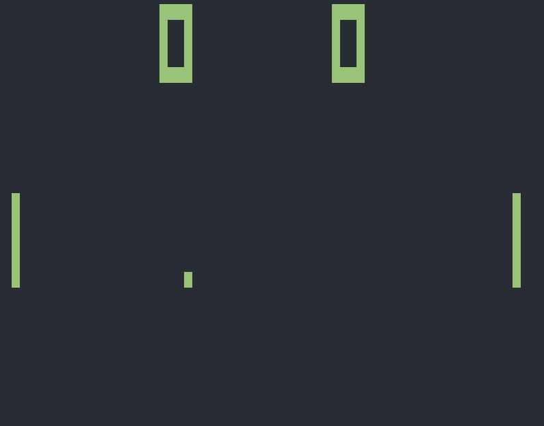

## Instructions to get the emulator running

Clone the repository and run the following commands in your terminal
```bash
cd CHIP8-Typescript
npm install
npm start
```

## Demo

*Pong*


*IBM Logo*
